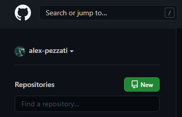
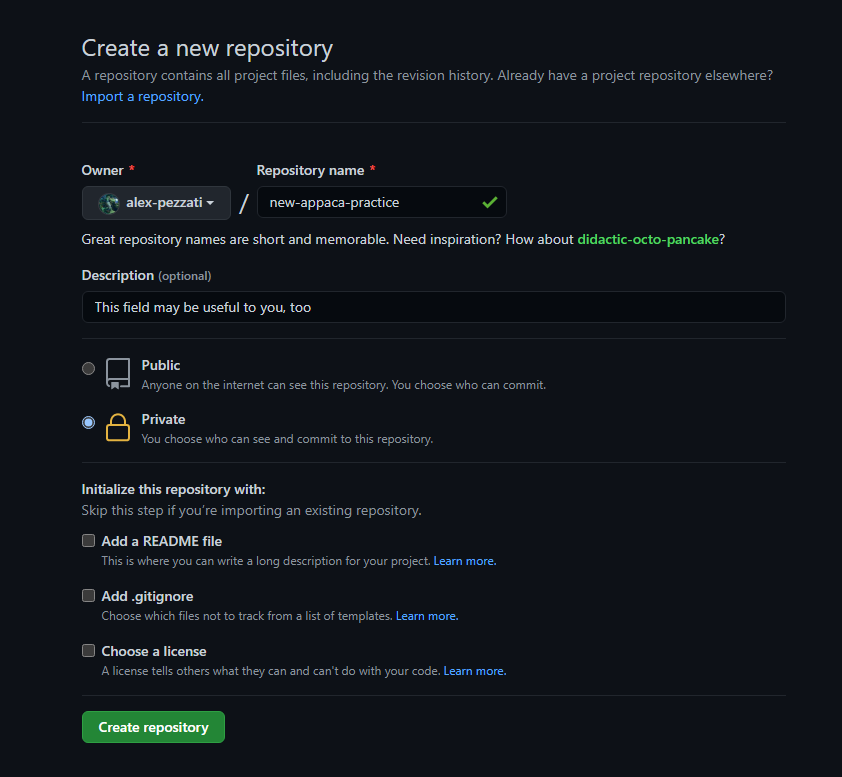
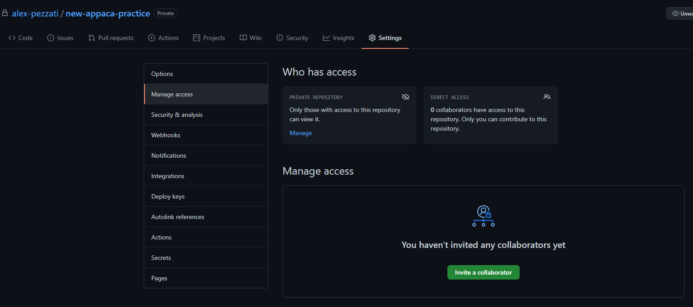
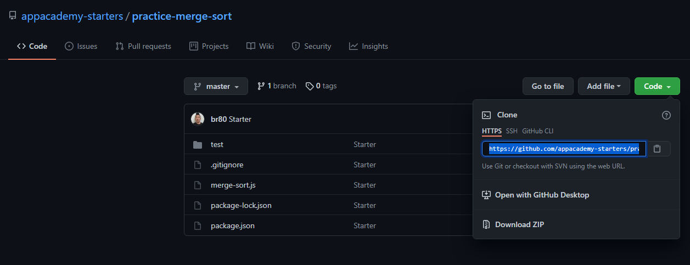

# Git Flow

This is a guide of _expected_ practices for git and GitHub while in a/A's Module 2: Computer Science and continued studies at a/A.

Let's git into it!

---

## Sections Covered In This Guide

-   [Pair Programming Git Flow Setup](#pair-programming-git-flow-setup)

    -   [Creating a GitHub Repo](#creating-a-github-repo)

    -   [Cloning a Repo From GitHub](#cloning-a-repo-from-github)

    -   [Connecting a Local Cloned Repo to a GitHub Repo](#connecting-a-local-cloned-repo-to-a-github-repo)

    <!-- For future expansion...  -->
    <!-- -   [Basic Git Commands](#basic-git-commands) -->

-   [FAQ](#faq)

    -   [Why are we not using `git init` here?](#why-are-we-not-using-git-init-here)

-   [External Resources](#external-resources)

---

## Pair Programming Git Flow Setup

_Before continuing_, you and your pair should decide who will create a repo to host the code on GitHub. Only one person will need to do this part. The other member's steps will be different.

**One member of pair will:**

-   `Create a new remote repo` on GitHub, and
    -   send the other pair a collaboration email invite through GitHub
-   `Clone the a/A starter` repo to their local computer
-   `Change the remote origin` of the local (cloned) repo to remote repo url on GitHub
-   `Change the default branch` name from "master" to "main"
-   `Push` the cloned code base to remote repo on GitHub

**Then, the other member of the pair will:**

-   Accept collaboration invite through the email they received
-   Clone the newly created repo to their local computer

Each member can then take turns driving and navigating, committing and pushing code, and swapping roles at regular intervals. The code that was pushed up by driver to the remote repo can be pulled down.

##### [Back to the top](#git-flow)

---

## Creating a GitHub Repo

-   Navigate to your homepage _OR_ repository overview tab on GitHub to find the big green `New` button to create a new repo.

    -   On the homepage you will see something like this in the top left:

        

    -   _OR_, on the overview page you will see these tabs and if you click on `Repositories` you will...

        

    -   ...see something like this on your repositories overview page

        

-   Configure your new repo:

    -   Name the new repo and set it to "Private".
    -   All other settings should be left at default.
    -   **Do not add** a `README` **nor** a `.gitignore` at this step. (These may cause conflicts if you are cloning another repo).
    -   Click the `Create repository` button.

        

-   Invite your pair as a collaborator to this repo:

    -   Look for the `Settings` button on the navbar and then the `Manage access` button.
    -   Use the big green `Invite a collaborator` button to look up your pair's GitHub username and send them an invite.
    -   The invited will need to accept the invite from their email in order to have access to the creator's repo.

        

##### [Back to the top](#git-flow)

---

## Cloning a Repo From GitHub

-   Navigate to the repo's url and click on the big green `Code` button to access the options for cloning the code base.

    -   NOTE: This guide demos the HTTPS method.

    

-   In your terminal, change to a directory you want your cloned local repo to reside.

    -   Clone the repo. Replace "URL" with the repo url you want to clone.

    ```
        git clone "URL"
    ```

    

-   If it the process completes successfully you will see an output similar to below:

    

-   Before we can push this code to our own remote repo we have to connect to it!

##### [Back to the top](#git-flow)

---

## Connecting a Local Cloned Repo to a GitHub Repo

-   Change our `remote origin` url to that of our GitHub repo. Replace "URL" with your repo url.

    ```
        git remote set-url origin "URL"
    ```

    

    -   _OPTIONAL: check our current remotes with_ `git remote -v` _to see if it worked!_

        ```
            git remote -v
        ```

        <!-- THIS IMAGE SHOULD BE CHANGEDl -->
        <!--  -->

-   If needed, rename our default branch from "master" to "main".
s
    ```
        git branch -M main
    ```

    

-   Push our code to the new remote.

    ```
        git push -u origin main
    ```

    

-   Checking our GitHub we should see the code on our repo! Your pair may now pull down the code after cloning your repo.

##### [Back to the top](#git-flow)

---

<!-- For future expansion...  -->
<!-- ## Basic Git Commands

[Git commands official documentation](https://git-scm.com/docs)

##### [Back to the top](#git-flow)

--- -->

## FAQ

### Why are we not using `git init` here?

-   Because we cloned a repo it already has a git history. It is inside of the .git hidden folder; you can see if it exists with `ls -a` in the root directory of your repo. The repo we cloned comes with a `remote origin`. We can check our current `remote` urls with the command `git remote -v`. Notice the `remote` labelled as origin is _pointing_ at a URL for an a/A starter. Instead of initializing git we just need change the `remote origin` to our new repo.

##### [Back to the top](#git-flow)

---

## External Resources

-   ### [Git Official Documentation](https://git-scm.com/docs)

-   ### [Git Setup - a/A Resource](https://github.com/appacademy/unified-setup/blob/main/github-setup.md)

##### [Back to the top](#git-flow)

<!--
This is a guide to advise a/A students transitioning from mod1 to mod2, whom have not yet had sufficient practice with cloning repositories from a/A starters.

The content is currently setup to scale, with certain sections commented out for future versions. The main unique (and scaling) section is the FAQ which can easily be filled with suggestions and documentation to address commonly encountered issues.

-Alex Pezzati 8/13/2021
-->

<!--
TO DO:
 [x] reduce/refine instructions 8/14/2021
 [ ] flesh out FAQ
 [ ] flesh out basic git commands (to act as glossary)
 [x] setup external resources section 8/14/2021
 [ ] flesh out external resources
 [ ] improve quality of screenshots
-->
